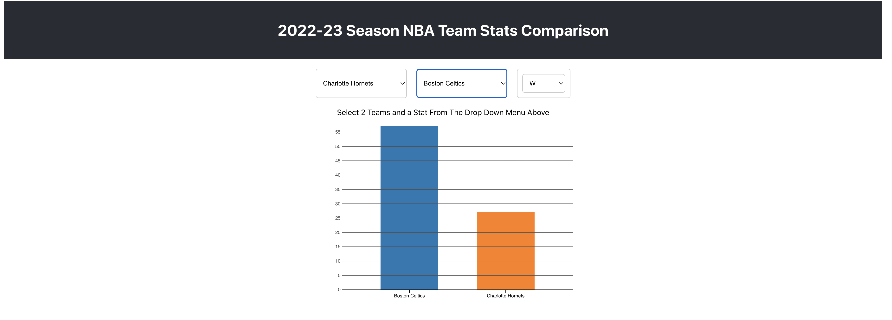

Final Project - Interactive Data Visualization

Our project consisted of gathering NBA team data from the 2022-23 season. This data was collected using the nba_api repository by swar patel. The backend directory holds the python
script used to gather this data in stats_by_year.py. The result of the script is in the public folder under the file name 2022_team_stats.csv. We also had a csv file containing each nba teams stats from 2000-2023 but the file was not used due to the complexity. From there we designed a react application
to show our data. We created react components for Barcharts, PieCharts, and the Scatterplot. We also used D3 in each of these components to visualize them. Our home page on the website provides animated and interactable charts to be used. The bar charts plot different stats like points, wins, losses, rebounds, and assists. We also used a tooltip to better format everything

nba_api link: https://github.com/swar/nba_api
video link: https://youtu.be/EhA3zXA6wOE
