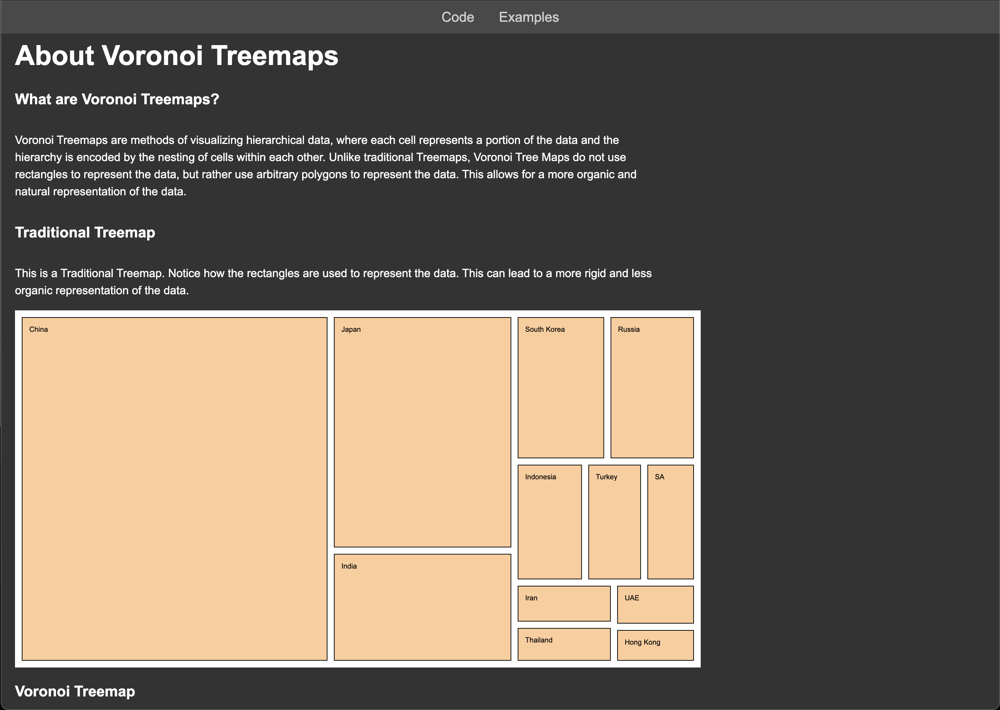
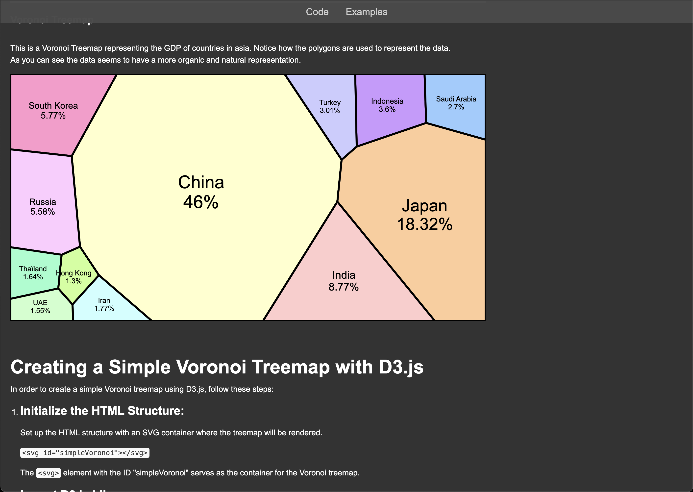
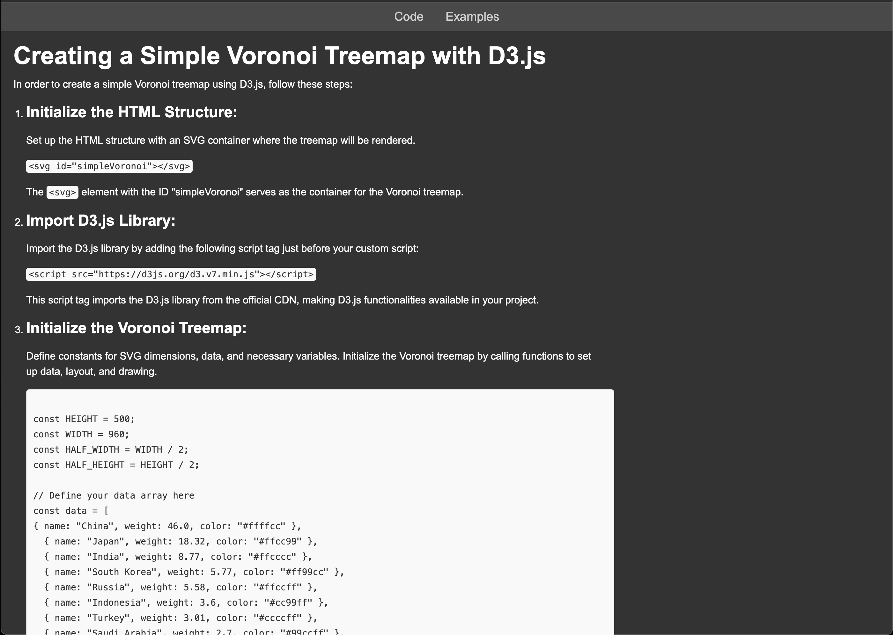
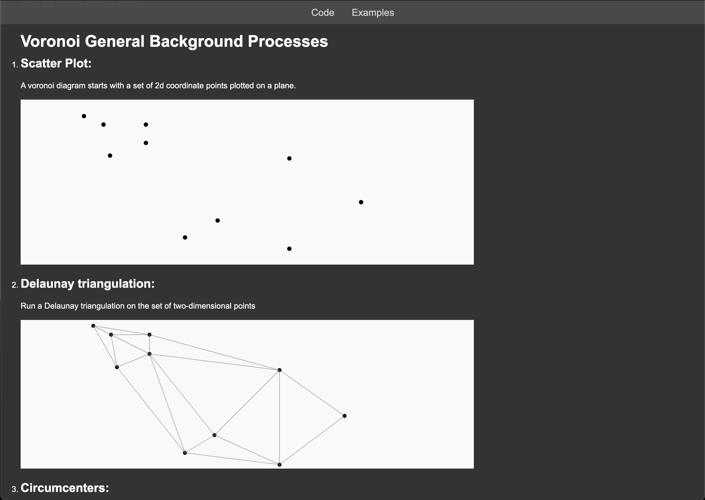
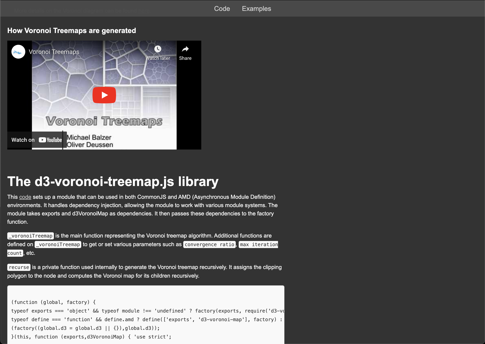
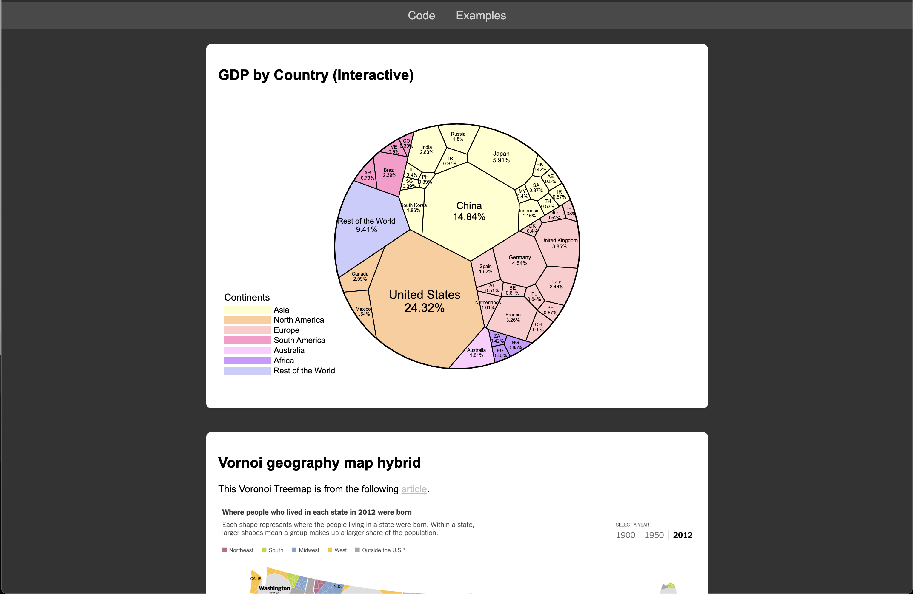
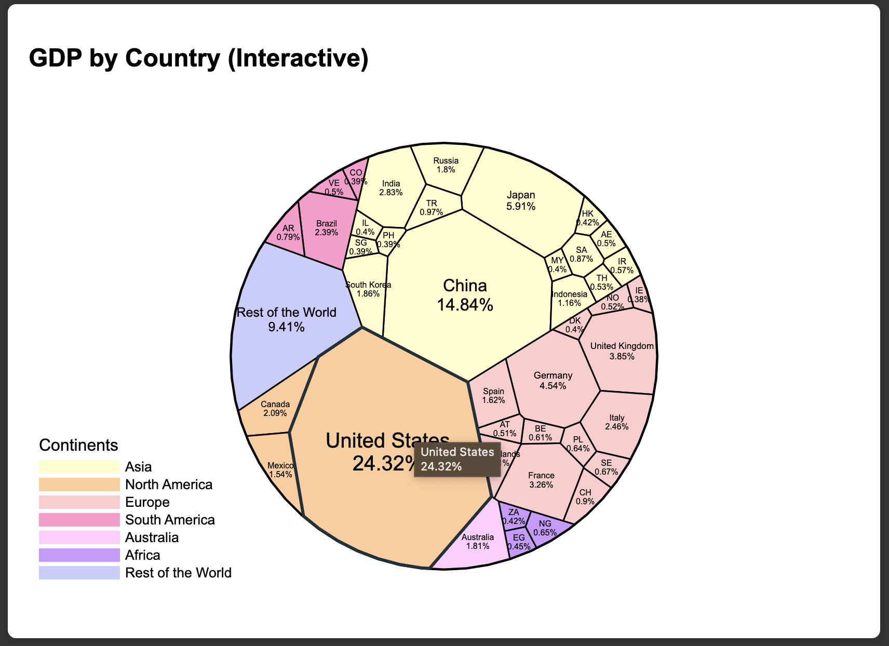
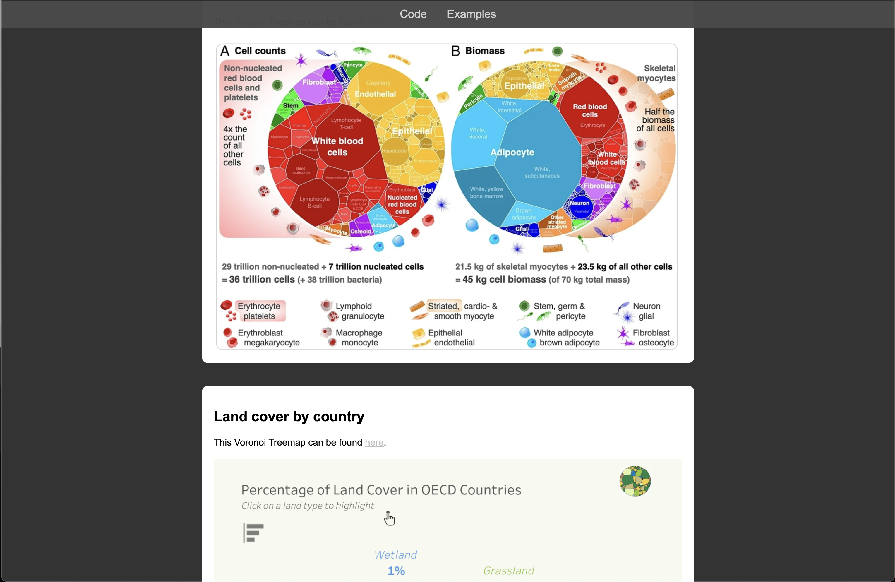

All About D3 Voronoi Treemaps
===

Link: https://azzhang3.github.io/final/

Video:

For our final project we decided to delve into and explore the world of Voronoi Treemaps. We did that by creating a website and a video which showcases it.

Design Achievements:
- We sent a prototype to Professor Harrison, for general feedback and review, and then implemented those feedbacks.
- We sent a prototype to a graphics design major, for feedback and review on the UI, and then implemented those feedbacks.
- The navbar follows some of the design principles from apple's website, with 0.98 opacity and color that matches the aesthetics of the general website design.
- The navbar has a hover effect, which slightly changes the color of the text when you hover over it. 
- We implemented a scrolling animation for pictures and codes, so it fades in as your scroll, which makes the website feel smoother to use.
- We implemented a dark and light mode based on your system preferences, so it doesn't blind the user if they are in dark mode.
- We implemented the first example in the examples sections, so users can interact with it, by hovering over the countries.
- We formatted the text so that the section titles are larger, and also added spacing between each section.
- We added a section for each example and provided links to the articles for clearer distinction between each example.
- We used a combination of CSS, JS, and HTML to format and ref
- Throughout the website, there are instances of pictures, videos, codes, links, descriptions, and examples to help the user better navigate and understand voronoi treemaps.
- We attempted to implement a button which allows the user to toggle, but that was still in progress.

Technical Achievements:
- We implemented a function for the scrolling effects, which uses an observer element to see if the picture is visible, and when it is it fades it in.
- We implemented a light and dark mode that checks and sees what your current system preferences are and adjusts the website's mode based on that. 
- We implemented a dynamic simple and a dynamic complex voronoi treemaps. The simple one is used in the code examples to not overwhelm the reader, and the complex is used in the examples to showcase the capabilities of voronoi treemaps.
- We implemented a hover effect in the complex voronoi treemap so users can interact with it. 
- We implemented two different pages and linked it to the navbar so it helps the user navigate our website.
- We used a combination of CSS, JS, and HTML to format and refactor the code, rather than having everything in the HTML. This makes it easier to make changes and adjustments later on.
- We attempted to implement a mobile version of the website, but that was still in progress.

Website Layout
---
## Code
This page provides general explanations for voronoi treemaps.

### About Voronoi Treemaps
The first section provides some background information, talking about what voronoi tree maps are and provides an example of a one. Additionally, in this section we provided an example of a default D3 rectangular treemap, so users can compare between the two. 

### Creating a Simple Voronoi Treemap with D3.js
The second section of the provides descriptions on how to create your own simple voronoi treemap with D3.js. In this section we provided a series of steps with detailed explanations and code examples, to help you get started. At the end of this section there is an Additional Info Section, which gives a basic overview of some of the major functions and algorithms that goes into making a voronoi treemap.

### Voronoi General Background Processes
The third section provides information on the general background processes of voronoi treemap. In this section we take a deeper dive into what is actually going on when a voronoi treemap is being produced. We provided some steps and sample screenshots of what is actually going on. Additionally, we provided a website and a video for those we want to look into it more.

### The d3-voronoi-treemap.js library
The final section provides information on the library with a link and some of the general code from it. Moreover, we provided explanations on two of the main functions that goes into developing and generating the voronoi treemap.

## Examples
This page provides some examples of voronoi treemaps.

Images of Website
---

